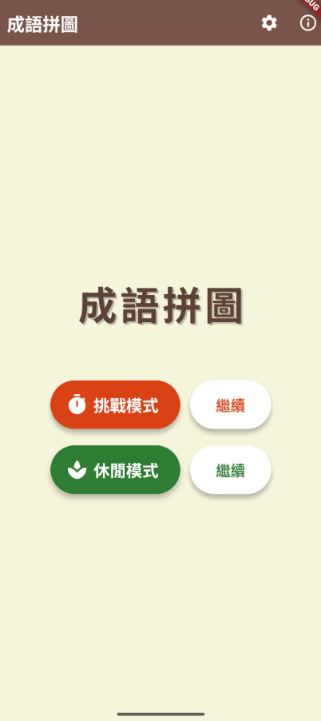
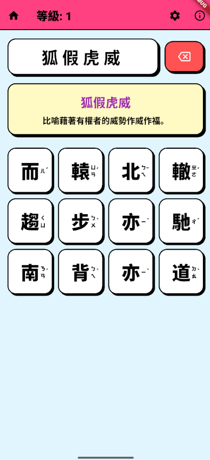

# 成語拼圖 (idiom_puzzle)

這是一個使用 Flutter 開發的專業成語拼圖遊戲。

## 專案簡介

玩家需要從提供的漢字網格中，選出正確的字元來組成成語。遊戲名稱已正式定為「**成語拼圖**」。

## 協助測試
1. 加入討論群組 (加入才能取得下載權限)
https://groups.google.com/g/idiom_puzzle

2. APP store 下載位置
https://play.google.com/store/apps/details?id=com.paddyliu.idiom_puzzle

3. 透過網路加入測試，測試人員可透過網路加入您的測試
https://play.google.com/apps/testing/com.paddyliu.idiom_puzzle

## 畫面展示

| 新中式 (傳統) | 科技暗色 | 卡通可愛 |
| :---: | :---: | :---: |
|  |  |  |
| *典雅古風* | *酷炫未來* | *活潑動漫* |

## 功能特色

- **多樣化遊戲模式**：提供「挑戰模式」與「休閒模式」。
  - **挑戰模式**：初始 100 秒，答對依難度增加時間，答錯扣 10 秒，考驗玩家反應與準確度。
  - **休閒模式**：無時間限制，輕鬆享受拼圖樂趣。
- **三種難度等級**：在挑戰模式中，可自由切換難度。
  - **簡單**：答對一題加 10 秒。
  - **中等**：答對一題加 5 秒。
  - **困難**：答對一題加 2 秒。
- **進度保存與續關**：系統會自動為挑戰模式與休閒模式保存獨立進度。若中途退出，主畫面會顯示「繼續」按鈕以恢復先前狀態。
- **三種視覺風格**：內建風格切換系統，滿足不同審美需求。
  - **新中式 (傳統)**：深棕與琥珀色調，古色古香。
  - **科技暗色**：深邃背景搭配霓虹青色，具備發光特效。
  - **卡通可愛**：高對比色、粗黑邊框與硬陰影，充滿 2D 動畫感。
- **智慧提示系統**：連續答錯 3 次時，系統會自動在資訊欄顯示隨機成語的兩個字作為提示。
- **等級與進度系統**：每清除一波成語即可提升等級，挑戰無上限。
- **操作優化**：支援點擊預選字再次取消選取，風格與難度切換採用直覺的下拉選單。
- **原生回饋系統**：整合系統級音效與 Haptic Feedback (觸覺震動)，提供流暢的反饋。
- **持久化設定**：自動儲存玩家選用的風格主題、音效開關、難度偏好。
- **豐富成語資料庫**：包含超過 240 條精選成語，具備直式注音顯示與詳細釋義。

